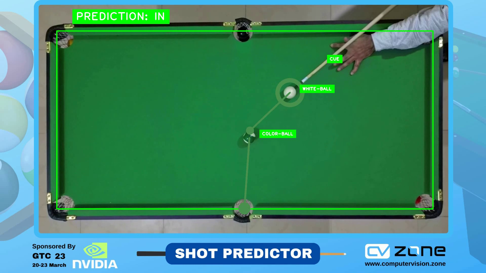

# Pool Shot Predictor
In this project, I started by applying image processing techniques to select the green color on the pool table. This involved converting the image into the HSV color space and thresholding it to obtain the contour of the green color. Once the contour was obtained, I used YOLOv8, an object detection algorithm, to detect the positions of the cue, white ball, and colored balls within that area. Next, I performed calculations to determine whether there was any collision or rebound between the balls. These calculations took into account the points and direction of the balls before and after the collision, as well as the angle of the table. By analyzing all the possible outcomes, I was able to predict the trajectory of the color ball and determine whether it would go into the pocket or not. Finally, I used the position information of the balls to calculate their respective direction and used this information to estimate the final position of the color ball. By combining all these techniques, I was able to create a system that could predict the trajectory of the color ball.

# The example of the results

